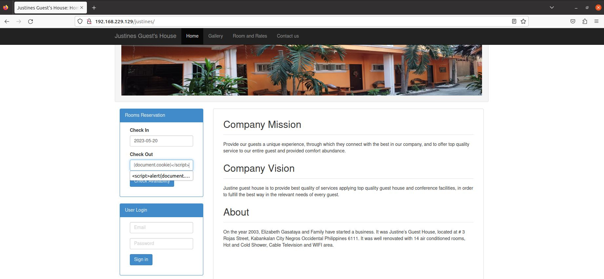
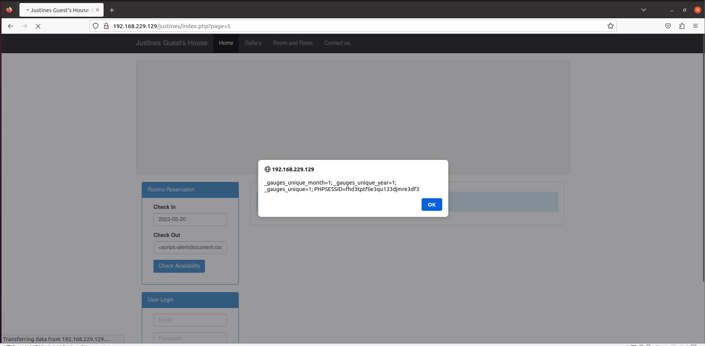
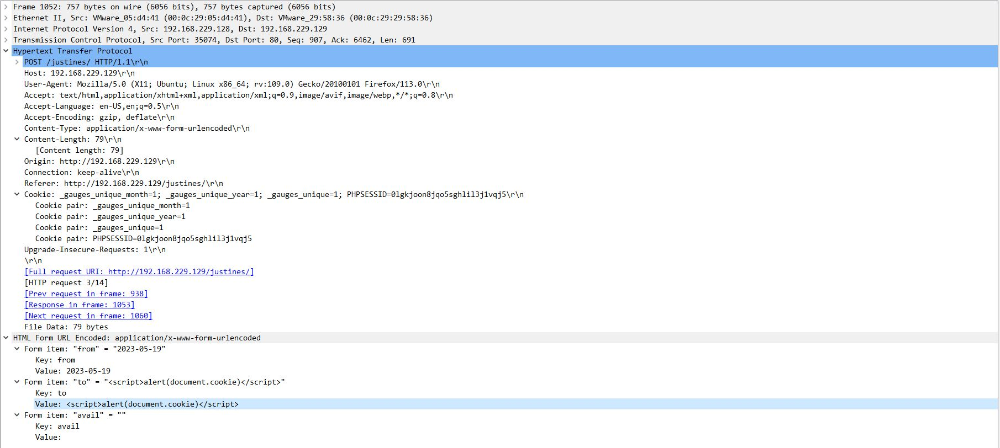

# itsourcecode_justines_css_vul

##### Some information

Vulnerability type: xss

Position: "body"

ParamKey: "to"

payload: ""

##### Process description

Enter payload in the date selection box.

The code executes successfully, displaying the user's cookie.

Packet capture data.

